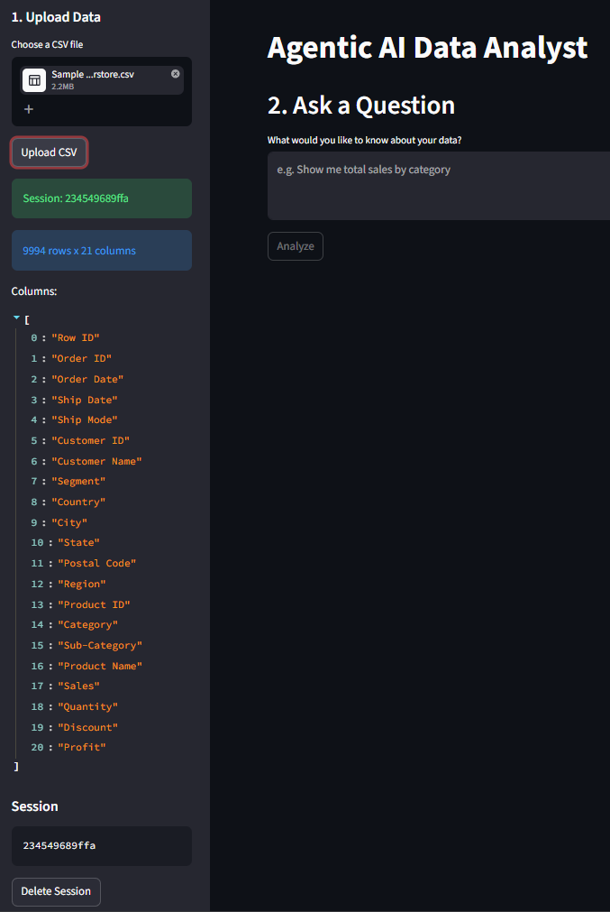
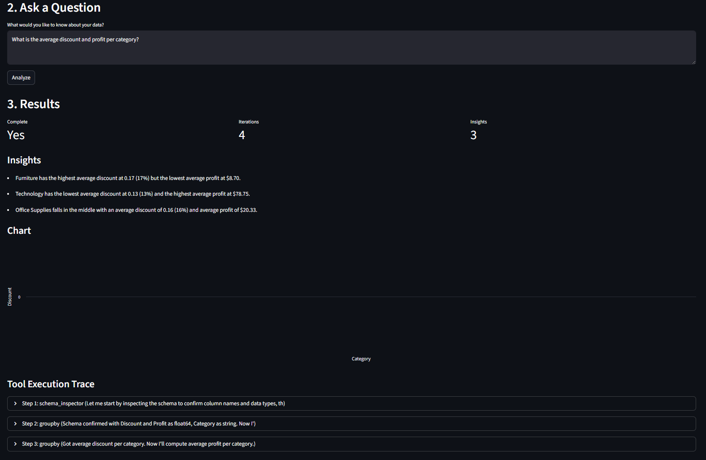
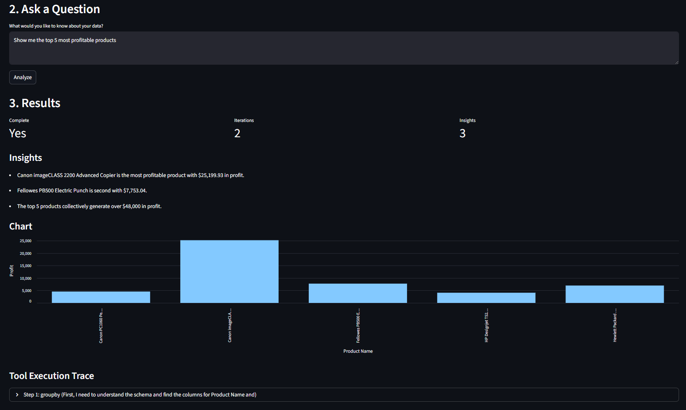
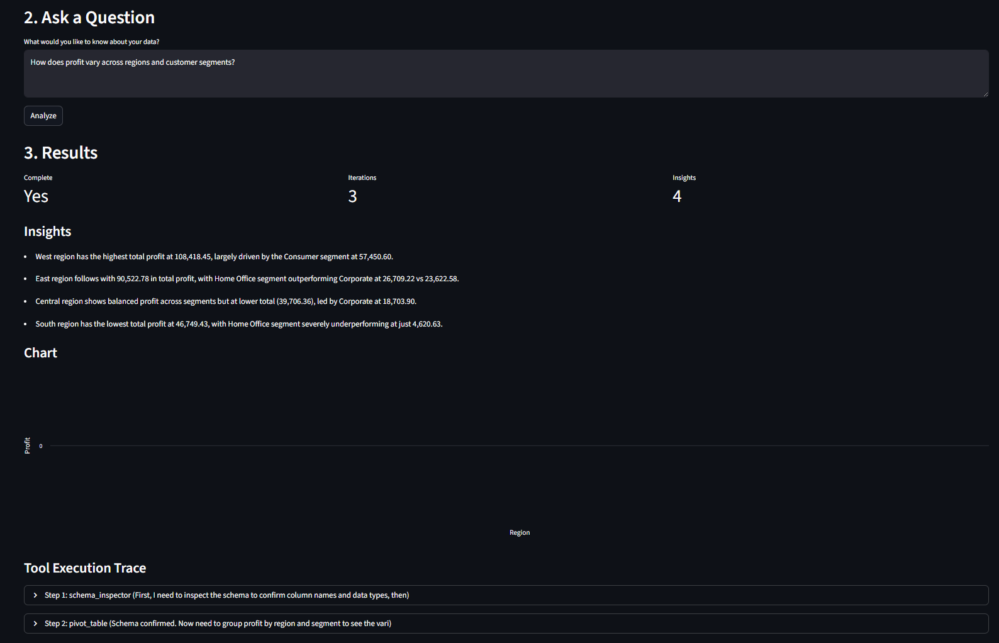
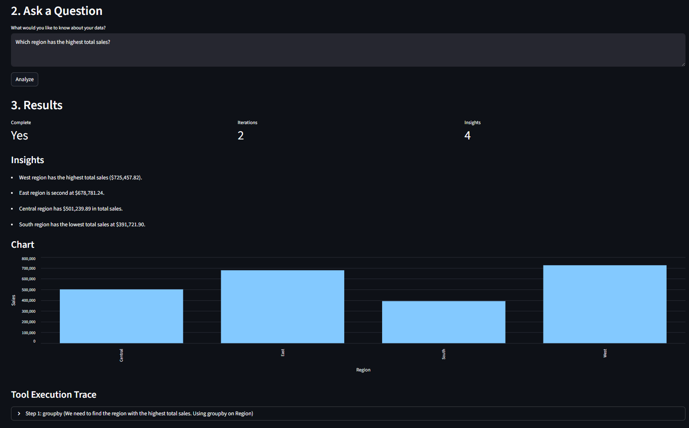

# Agentic AI Data Analyst

An AI-powered analytics platform that lets you upload CSV datasets, ask questions in natural language, and receive automated insights and interactive visualizations — without writing any code.

The system uses a **bounded autonomy** architecture: the LLM orchestrates predefined analytical tools instead of directly manipulating dataframes, ensuring safe and predictable execution.

### Why Bounded Autonomy?

Most AI analytics tools let the LLM generate arbitrary code (Python, SQL) and execute it directly — powerful but risky. The LLM can produce incorrect or unsafe operations that corrupt data or produce misleading results.

This project takes a different approach: the LLM **never directly manipulates data or executes code**. Instead, it selects from a predefined set of analytical tools, and the backend executes them safely within validated boundaries.

- **Safer** — No arbitrary code execution, no SQL injection, no accidental data corruption
- **Predictable** — Every tool has a defined contract with validated parameters
- **Transparent** — Every step is logged in the execution trace, making analysis reproducible and auditable
- **Reliable** — Error boundaries and iteration limits prevent runaway or infinite-loop behavior

### Core Concepts

- **Bounded Autonomy** — The LLM operates within a fixed tool registry, finite iterations, and backend-enforced validation
- **Tool Orchestration** — The LLM chains analytical tools (filter, group, aggregate, pivot) autonomously based on the user's natural-language query
- **Iterative Reasoning Loop** — Each iteration: LLM analyzes tool results → decides next step → calls a tool → receives new data, repeating until the answer is complete
- **Structured JSON Contracts** — All LLM-to-system communication uses Pydantic-validated models, not freeform text
- **Execution Trace Transparency** — Every tool call, parameter, response, and execution time is logged and displayed in the UI

---

## Features

- **CSV Upload** — Upload any CSV, automatic schema inspection, session management
- **Natural Language Querying** — Ask business questions in plain English
- **Autonomous Multi-Step Analysis** — LLM chains tools to answer complex queries
- **13 Analytical Operations** — GroupBy, filtering, correlation, pivot tables, date extraction, derived columns, sorting, summary stats, and more
- **Chart Generation** — LLM-generated Vega-Lite charts (bar, line, scatter)
- **Insight Extraction** — Natural-language summaries with specific numbers
- **Execution Trace** — Full log of every tool call, parameters, response, and timing
- **Multi-Provider LLM** — Supports OpenAI (OpenRouter), Google Gemini, and local Ollama

---

## Demo

### Upload & Dataset Initialization



---

### Agentic Regional Sales Workflow



---

### Top Product Profitability Analysis



---

### Multi-Dimensional Profit Analysis



---

### Category Analysis: Schema-to-Insight Workflow



---

## Tech Stack

| Layer | Technology |
|---|---|
| **Backend** | Python 3.12+, FastAPI, Uvicorn, Pandas, Pydantic |
| **Frontend** | Streamlit, Vega-Lite (Altair) |
| **LLM Integration** | OpenAI API (OpenRouter), Google Gemini, Ollama |
| **Testing** | pytest |
| **Infrastructure** | Git, pip, virtualenv |

---

## Architecture

```
User (Browser)
     │
     ▼
┌──────────────────┐
│  Streamlit UI    │  frontend/app.py
│  (Port 8501)     │
└────────┬─────────┘
         │ HTTP
         ▼
┌──────────────────┐
│  FastAPI Backend │  backend/main.py
│  (Port 8000)     │
└────────┬─────────┘
         │
    ┌────┴────┐
    ▼         ▼
┌────────┐ ┌──────────┐
│ Agent  │ │ Services │
│(orches-│ │ • Session│
│ trator)│ │ • LLM    │
└───┬────┘ └──────────┘
    │
    ▼
┌──────────┐
│  Tools   │  • 13 operations
│  Layer   │  • BaseTool ABC
└──────────┘
```

The analysis loop works as follows:

1. User uploads CSV → Backend parses it into a DataFrame, creates a session
2. User enters a query → Backend enters a bounded loop (max 10 iterations)
3. LLM decides: either **mark complete** (with insights + chart) or **call a tool**
4. If a tool is called, the backend executes it on the session's DataFrame
5. Result is fed back to the LLM, which decides the next step
6. Loop ends when the LLM marks complete, max iterations hit, or errors exceed threshold

---

## Project Structure

```
agentic-ai-da/
│
├── backend/
│   ├── main.py                 # FastAPI app, routes, tool registration
│   ├── agent/
│   │   └── orchestrator.py     # Bounded iterative analysis loop
│   ├── models/
│   │   └── schemas.py          # Pydantic data contracts
│   ├── services/
│   │   ├── llm_service.py      # LLM API abstraction (Gemini, OpenAI, Ollama)
│   │   └── session_service.py  # In-memory session/DataFrame store
│   └── tools/
│       ├── base.py             # BaseTool abstract class
│       ├── registry.py         # ToolRegistry
│       ├── inspection.py       # SchemaInspector, MissingValueAnalyzer
│       ├── operations.py       # GroupBy, FilterTool, DeriveAggregate, Reset
│       └── analysis.py         # SortTopK, ValueCounts, SummaryStats, etc.
│
├── frontend/
│   └── app.py                  # Streamlit UI
│
├── tests/
│   ├── conftest.py             # Shared test fixtures
│   ├── test_tools.py           # Unit tests for all 13 tools
│   ├── test_orchestrator.py    # Orchestrator loop tests
│   └── test_session.py         # Session store tests
│
├── assets/                     # Demo screenshots
├── data/
│   └── sales_data.csv          # Sample dataset (100 rows)
├── docs/
│   └── architecture.md         # Detailed architecture document
│
├── .env.example                # Environment variable template
├── requirements.txt
└── README.md
```

---

## Quick Start

### Prerequisites

- Python 3.12+
- An LLM API key (OpenRouter, Gemini, or OpenAI)
- (Optional) Ollama for local LLM

### Setup

1. Clone the repository:
```bash
git clone https://github.com/lakshaylv/agentic-ai-DA.git
cd agentic-ai-da
```

2. Create and activate a virtual environment:
```bash
python3 -m venv venv
source venv/bin/activate
```

3. Install dependencies:
```bash
pip install -r requirements.txt
```

4. Set up environment variables:
```bash
cp .env.example .env
# Edit .env and add your API key(s) and preferred provider
```

5. Start the backend:
```bash
uvicorn backend.main:app --reload
```

6. In a new terminal, start the frontend:
```bash
streamlit run frontend/app.py
```

7. Open http://localhost:8501 in your browser

---

## API Endpoints

| Method | Path | Description |
|---|---|---|
| `GET` | `/health` | Health check |
| `POST` | `/upload` | Upload CSV file |
| `GET` | `/sessions` | List active sessions |
| `DELETE` | `/sessions/{id}` | Delete a session |
| `POST` | `/analyze` | Run natural-language analysis |

---

## Design Philosophy: Bounded Autonomy

The LLM operates within strict boundaries:

- **No direct dataframe access** — The LLM only selects tools; the backend executes them
- **Fixed tool registry** — Only 13 predefined operations available
- **Finite iterations** — Max 10 iterations per query (configurable)
- **Error boundaries** — Max 3 consecutive failures before aborting
- **Structured contracts** — All LLM responses are validated Pydantic models
- **No arbitrary code execution** — The LLM cannot run arbitrary Python, SQL, or shell commands

This creates a safe, predictable, and maintainable system suitable for portfolio and production use.

---

## Testing

```bash
pytest tests/ -v
```

82 tests covering:
- All 13 analytical tools
- Orchestrator loop scenarios (immediate completion, tool chain, max iterations, error handling)
- Session store (CRUD, thread safety)

---

## Limitations

- Single-table analysis only (no joins or multi-table queries)
- In-memory session storage (state is lost on server restart)
- Charts limited to bar, line, and scatter (no geographical or complex visualizations)
- LLM quality depends on the provider and model used

---

## License

MIT
